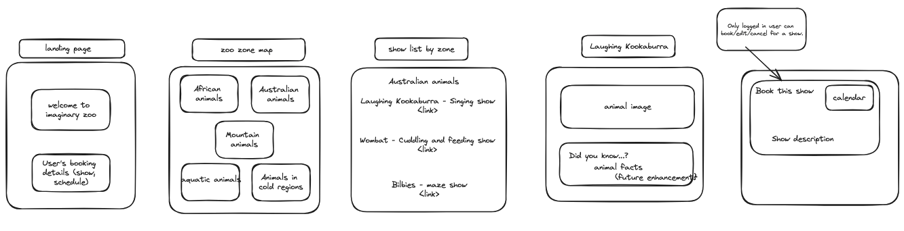
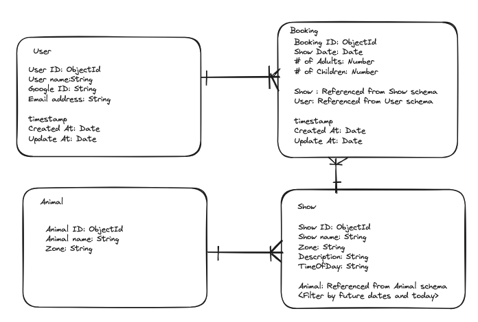

# Animal Shows Booking
A booking app for animal shows. 
As a user, I want to see a list of zoo zones, those of which have a list of animals. When I go to an individual animal show page, I want to create a booking for an animal show by selecting a date and # of visitors (adults and children). I also want to edit/update my booking and cancel/delete. My bookings should be in ascending order so that I can see the latest date at the top. I should not be able to book for past dates in create booking on animal show page and my bookings edit page. On animal show booking page, I should not see past bookings, but I should see all booking history on My Booking page. I would like to see weather forecast as it helps me decide which date to book.

# URL
https://animal-shows-booking.onrender.com

# App image

# Wireframe

# Entity relationship diagram

# Technologies Used
- JavaScript
- HTML
- CSS
- Node.js
- Express
- MongoDB and Mongoose

# Getting Started
- [X] Wireframe and Trello board
- [X] Create schemas
- [X] Zones (tiles)
- [X] Lists of animal shows (tiles)
- [X] Add authentication feature
- [X] Booking - Create /Individual animal page
- [X] Booking - Edit
- [X] Booking - Delete
- [X] Add animal images
- [X] Add ensureloggedin
- [X] Add 'My Bookings' for logged in users
- [X] Sort booking details in ascending order
- [X] Show bookings past dates and future dates sections
- [X] Disable users not to book for the same show for the same day
- [X] Disable past dates booking
- [X] css
- [X] Restful routing
- [X] Deploy the app
- [X] Add API

# Next Steps
- Show weather icon (sunny, etc)
- Move weather forecast in nav instead of landing page
- Save weather forecast in MongoDB
- Add more animals
- Add animal facts in seed.js
- Add # of visitors validation in controller (Minimum One adult per booking and maximum 5 adults and 5 children)
- Add dark mode (view)
- Add Zoo admin feature for the zoo to manage bookings

# Presentation script
I made a show booking app for an imaginary zoo, Animal’s wonderland. The app has features of showing zoo zones, animals by zone, animal shows, in addition to creating, editing and deleting bookings. To be user centric, I added booking function in animal show page. The app also has “My Booking” page. 
I used seed json files to load animals and animal shows information as well.
I added weather forecast using weather API on landing page. I chose AccuWeather that has daily maximum calls of 50. I added json file for weather data in order not to exceed this daily limit as a temporary solution.

< Log in + Show CRUD operations : Japanese Boar >
While working on this project, CRUD operation also meant my daily routine of Cry - Recoil - Upset - Devastate. 
Booking feature is only available to logged-in users. So, when you go to animal show page without logging in, a message appears asking users to log in. 
On an animal show page, you see only future bookings and the app does not allow users to book for past dates and displays a message to ask users to re-select a date. I set maximum number of visitors five adults, five children and there must be one adult in a booking.

< Demonstrate past date booking attempt > 
< Move to My Bookings >
For updating and deleting bookings, I made My Booking section. Your booking details are shown by upcoming ones and past ones, both are shown by date order (ascending). You can also move to each animal show page from here. On booking editing page, you can not select past dates as well. To delete your booking, simply click on Delete. 
  
< Mongoose model: Display ERD then vs code >
I have three schemas in addition to User schema. My main model is Booking. Animal and Show models support the booking model. Booking schema references Show and User. Show schema references Animal. 

< Show booking routes then bookings controller and shows controller >
My CRUD operations are in bookings and shows. < Move to bookings then *shows *controller >

< Challenges >
I think handling dates is the most challenging part of this project. I did not have to worry about time component before I added separating future bookings and past bookings, 
< Show “My Bookings” page >
 and disabling users not to book for past dates. 

< Back to vs code - shows controllers - bookAnimalShow function >
However, in order to add these validations, I had to combine date from user input (i.e. calendar YYYY MM DD) and time from ‘time of day’ in Show schema. 
< Show shows controller - bookAnimalShow function - if statement >
To prevent double booking, I needed to compare date in an existing booking in Mongo DB, so the date is in ISO format, and the date from user input (date component only ) so that I needed to add time component like this. 
< Show bookAnimalShow function - “const dateAndTime, dateCombined >

I also needed to check for double booking so I added validation like this too. 
< Show existingBooking variable in shows controller > From this, I learnt how to filter my query from mongoose using ‘grater than or equal to ($gte)’ and less than (‘&lt’).

< Show my favourite EJS template >
< Show Pigmy Hippo page >
My favourite EJS template is animal show page as I think it is user-friendly. Although it is less developer-friendly,  users don’t have to go to booking dedicated page in this way,. 
By the way, I saved animal images in the public - images directory. Photos are named exactly the same as in Animal Schema so that I did not need to save paths in the DB ( instead of doing this: Storing Images locally and Saving Paths in the Database)
 
< Key learning > < Show the screenshot >
I learnt the importance of RESTful route in a painful way. At first I made my app “/zones/each zone/each animal/each animal show”. This made my CRUD operations difficult, not being able to use _id info in mongoDB. Then, I finally realised that I should have done /animals/:id, /shows/:id. I had to update routes and controllers then ejs. Only after that, I was able to use findById and this saved my tears (although I cried a lot before then).
