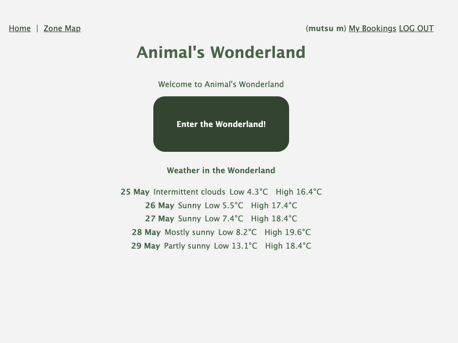

# Animal Shows Booking
A booking app for animal shows. 
As a user, I want to see a list of zoo zones, those of which have a list of animals. When I go to an individual animal show page, I want to create a booking for an animal show by selecting a date and # of visitors (adults and children). I also want to edit/update my booking and cancel/delete. My bookings should be in ascending order so that I can see the latest date at the top.  

# URL
https://animal-shows-booking.onrender.com

# App image
./photos-read-me/landing-page.png

# Wireframe

# Entity relationship diagram

# Technologies Used
- JavaScript
- HTML
- CSS
- Node.js
- Express
- MongoDB and Mongoose

# Getting Started
- [X] Wireframe and Trello board
- [X] Create schemas
- [X] Zones (tiles)
- [X] Lists of animal shows (tiles)
- [X] Add authentication feature
- [X] Booking - Create /Individual animal page
- [X] Booking - Edit
- [X] Booking - Delete
- [X] Add animal images
- [X] Add ensureloggedin
- [X] Add 'My Bookings' for logged in users
- [X] Sort booking details in ascending order
- [X] Show bookings past dates and future dates sections
- [X] Disable users not to book for the same show for the same day
- [X] Disable past dates booking
- [X] css
- [X] Restful routing
- [X] Deploy the app
- [X] Add API

# Next Steps
- Show weather icon (sunny, etc)
- Move weather forecast in nav instead of landing page
- Add more animals
- Add animal facts in seed.js
- Add dark mode (view) 